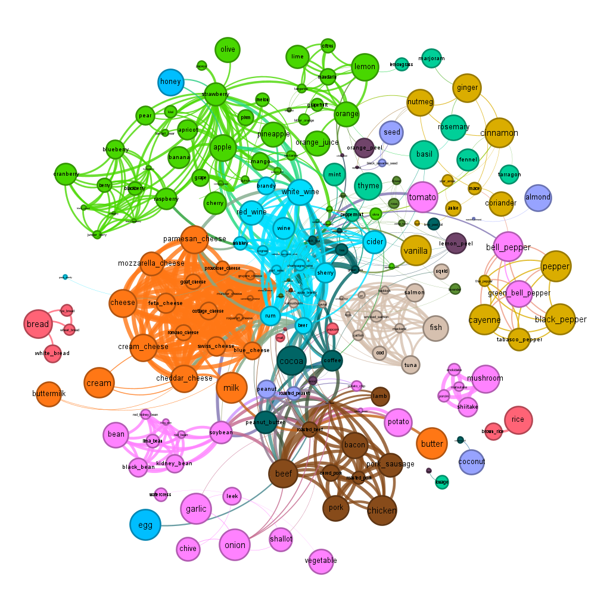

# Mini-Project: Reproducing the Network Science Approach in Flavor Network and the Principles of Food Pairing

## Project Goal and Scope

This mini-project aims to replicate a case study from a scientific paper that used a network science approach to investigate the flavor network of culinary ingredients. The goal is to uncover general patterns in ingredient combinations and understand food pairing principles using data-driven network analysis methods.

**Limitations and scope**: The project inherits limitations from the original paper, focusing on the relationship between ingredients and their flavor components, while acknowledging the limitations of the available data. The project discards most statistical analysis, concentrating on network science methods.

## Case of Study

The paper _Flavor network and the principles of food pairing_ by Yong-Yeol Ahn, Sebastian E. Ahnert, James P. Bagrow, and Albert-László Barabási served as the case study. The researchers investigated shared flavor compounds between ingredients in various global cuisines to identify general patterns and understand food pairing principles.



## Data Set Description

This project uses four datasets:

- `recipes.csv`: A list of 56,498 recipes from 10 different culinary regions.
- `compounds.tsv`: A table with 1,106 records of different chemical compounds found in ingredients.
- `ingredients.tsv`: A table with 1,580 records of ingredients and their categories.
- `ingredient-compound.tsv`: A table with 36,781 records linking ingredients to chemical compounds.

## Implemented Network Science Approach

The primary goal is to verify the food pairing hypothesis, asserting that ingredients sharing flavor compounds form delicious combinations. The paper introduces a bipartite network with nodes representing ingredients and chemical compounds. A projection of this bipartite network produces the flavor network, where two ingredients are connected if they share at least one flavor compound. The network science approach aims to determine whether strongly linked ingredient pairs in the flavor network are more commonly used than weakly linked or unlinked pairs.


## Python Virtual Environment and Jupyter for Food Pairing Analysis

This project demonstrates the use of Python virtual environments and Jupyter Notebooks in Visual Studio Code to analyze food pairing data using various algorithms. In this README, you'll find instructions for setting up the virtual environment, installing required libraries, and integrating Jupyter into Visual Studio Code. It is recommended to use WSL with Ubuntu or Windows to create the virtual environment.


## Setting up the virtual environment

1. First, make sure you have Python installed on your system. You can download it from [the official website](https://www.python.org/downloads/).

2. Create a virtual environment within the project folder:

```sh
python -m venv env

```

3. Activate the virtual environment:

- On Windows:
  ```sh
  env\Scripts\activate
  ```

- On Linux/Mac:
  ```sh
  source env/bin/activate

  ```

4. Install the required libraries listed in the `requirements.txt` file:

```sh
pip install -r requirements.txt

```

## Integrating the virtual environment with Jupyter for Visual Studio Code

1. Install the Jupyter extension for Visual Studio Code from the [Visual Studio Code Marketplace](https://marketplace.visualstudio.com/items?itemName=ms-toolsai.jupyter).

2. Open the Command Palette (Ctrl+Shift+P or Cmd+Shift+P), and select "Python: Select Interpreter."

3. Choose the Python interpreter located in the `env` folder.

4. Create a new Jupyter Notebook by clicking on the "Jupyter" icon in the sidebar, then click "Create New Notebook."

5. You can now use Jupyter Notebooks within Visual Studio Code, and it will use the Python interpreter from the virtual environment.

## Deactivate the Virtual Environment

When you're done working on the project and want to deactivate the virtual environment, follow these steps based on your operating system and the method used to create the virtual environment:

### Virtual environment created with `venv` (Python 3.3+)

#### Windows

To deactivate the virtual environment on Windows, run the following command in the terminal:

```cmd
deactivate
```
#### macOS/Linux
To deactivate the virtual environment on macOS or Linux, run the following command in the terminal:

 ```sh
deactivate
```

## Libraries and algorithms

This project makes use of the following libraries:

- numpy
- pandas
- networkx
- glob
- node2vec

And it focuses on the following algorithms:

- Pathfinding Algorithms: Help identify optimal paths between nodes in a graph.
- Centrality Algorithms: Measure the importance of nodes within a graph.
- Community Detection Algorithms: Identify groups of nodes that are more densely connected within a graph.
- Similarity Algorithms: Measure the similarity between nodes in a graph.
- Node Embedding: Generate low-dimensional feature representations for nodes in a graph, which can be used for various machine learning tasks.

## Windows Subsystem for Linux (WSL) and Ubuntu

It is recommended to use the Windows Subsystem for Linux (WSL) and Ubuntu on Windows for a better development experience compared to the traditional CMD or PowerShell. WSL provides a Linux-compatible kernel interface and allows you to run native Linux binaries on your Windows machine. Some advantages of using WSL and Ubuntu over CMD and PowerShell include:

- Access to a large collection of Linux tools and utilities.
- Improved terminal experience with better support for color and formatting.
- Seamless integration between Windows and Linux file systems.
- Easier management of Python and other programming language environments.
- Better support for version control systems like Git.

To install WSL and Ubuntu on your Windows machine, follow the instructions in this [Microsoft guide](https://docs.microsoft.com/en-us/windows/wsl/install).

After installing WSL and Ubuntu, you can use the same virtual environment setup and Jupyter integration steps mentioned earlier in this README.

## Prueba
